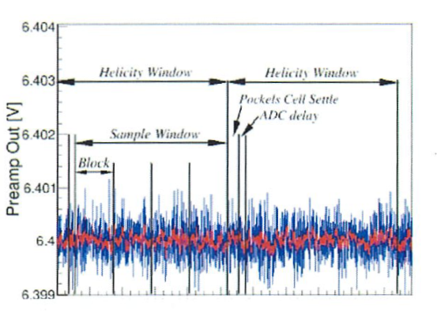
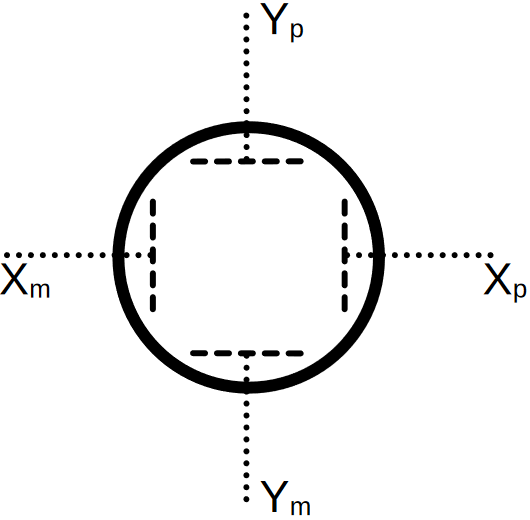
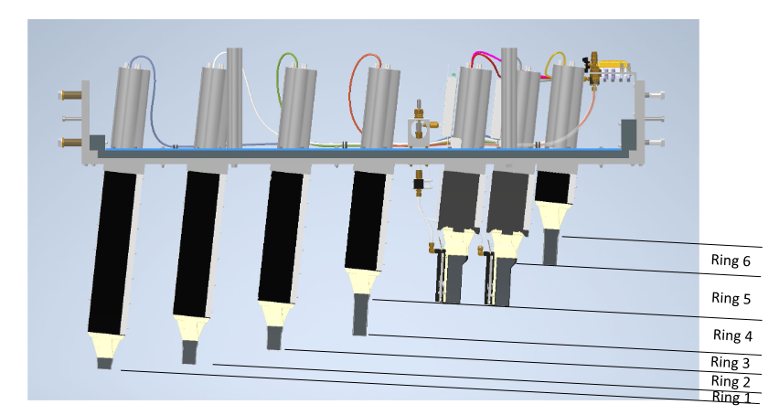
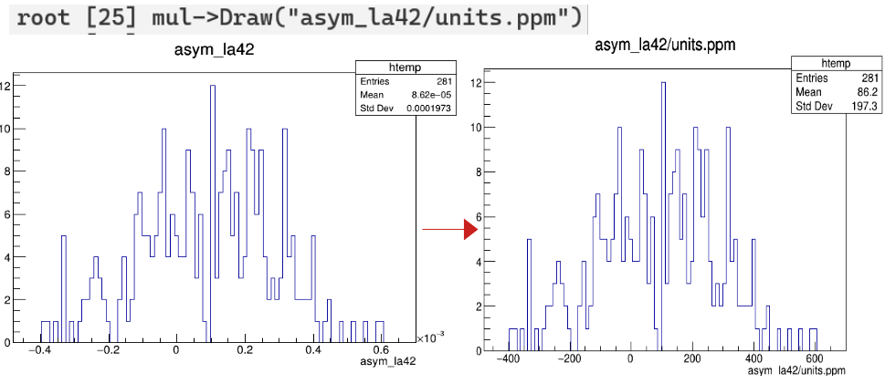
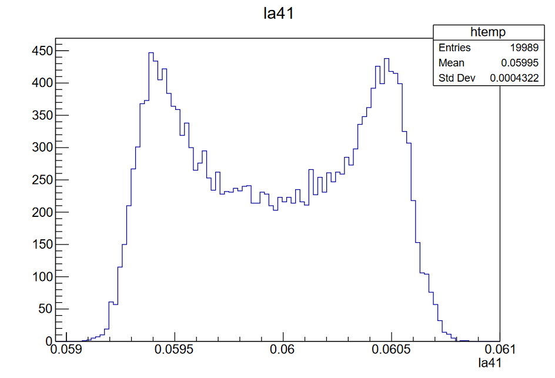
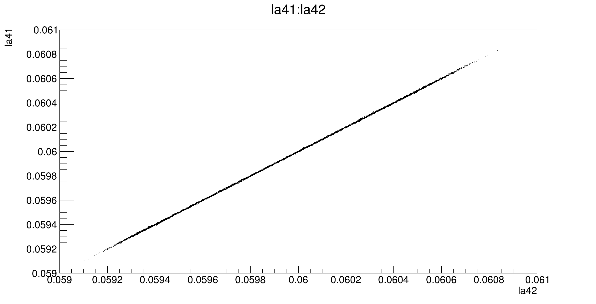
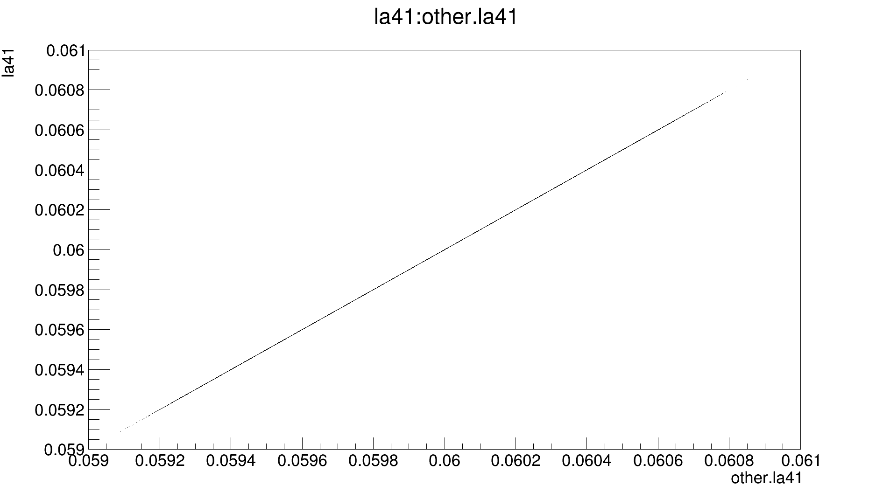

# QwMockData Root Guide

July 29, 2024\
Version 1.1


If you have any questions or suggestions for the guide, please send an
email to:\
Ryan Conaway\
mrc@jlab.org

Running QwMockDataGenerator
===========================

Using the JAPAN-MOLLER repository, run the following commands in a
terminal:

        $  build/qwmockdatagenerator -r 4 -e 1:20000 --config qwparity_simple.conf --detectors mock_newdets.map --data <Data>

        $  build/qwparity -r 4 --config qwparity_simple.conf --detectors mock_newdets.map --datahandlers mock_datahandlers.map --data <Data> --rootfiles <Rootfiles>

General ROOT TTree Format
=========================

The ROOT TTree (or just ROOT Tree) represents columnar datasets. Each
columnar dataset is stored in a "branch" of the tree. Each branch can
have several different variables stored within the dataset, called
"leaves".

Accessing
=========

Once the rootfiles have been generated, you can access the data in two
parallel ways:

GUI
---

In a terminal, run

        $ root
        root[0] TBrowser b

A ROOT Object Browser should appear. Using this browser, you can navigate to the rootfile and access the ROOT tree.

Terminal
--------

In a terminal, run

        $ root
        root[0] TFile* f = new TFile("<path/to/rootfile>")
        root[1] .ls

This will display all the objects (e.g. TTrees) inside the opened rootfile, with the form

      KEY: <OBJECT_TYPE>   <NAME>;<NAMECYCLE>   <DESCRIPTION>

To view a tree, run

        root[2] <NAME> -> Print()

This will display the branches and the leaves, with the form

      BR #:  <BRANCH_NAME> :  <leaf 1>/D:<leaf 2>.../D:<leaf N>/D:

To draw a branch, run

        root[3] <NAME> -> Draw("<BRANCH_NAME>")

To draw a leaf in the branch, run

        root[4] <NAME> -> Draw("<BRANCH_NAME>.<leaf>")

Mock Data Rootfile
==================

Opening a mock data rootfile, we should see

``` {.c}
    root[0] TFile* f = new TFile("isu_sample_4.root")
    (TFile*) 0x55ede7b9a3e0
    root[1] .ls
    TFile**          isu_sample_4.root       myfile1
     TFile*          isu_sample_4.root       myfile1
      KEY: TLIST     4_condition;1       Doubly linked list
      KEY: TLIST     mapfiles;1          Doubly linked list
      KEY: TDirectoryFile evt_histo;1       evt_histo
      KEY: TDirectoryFile mul_histo;1       mul_histo
      KEY: TDirectoryFile burst_histo;1     burst_histo
      KEY: TDirectoryFile objects;1         objects
      KEY: TTree     evt;1      MPS event data tree
      KEY: TTree     mul;1      Helicity event data tree
      KEY: TTree     pr;1       Pair tree
      KEY: TTree     evts;1     Running sum tree
      KEY: TTree     muls;1     Running sum tree
      KEY: TTree     bursts;1     Burst running sum tree
```

The first two rows displays what file is loaded into memory and all
consecutive rows are the objects that the file contains. Each object has
a `KEY` that indicates what the type of the object stored within the
file; we can see that our file has two `TList` objects, four
`TDirectoryFile` objects, and six `TTree` objects. Each object is
followed by the name of the object. The last column is a brief
description of what is contained in the the tree. To access objects in a
ROOT file, it is often sufficient to use the name of the object
directly:

``` {.c}
    root[0] evt->Print()
```

The TTree objects and their contents are the main focus of the guide.
For completeness, we will briefly discuss the TList objects as well.

Conditions
----------

The TList object, `#_conditions`, contains the meta-data for the
QwAnalyzer. It contains the ROOT version, the hostname, rootfile
creation time, analyzer options used, the analyzer version, and other
misc. meta-data.

``` {.c}
    root[2] TList* conditions = (TList*)f->Get("4_condition")
    (TList*) 0x55a04178aa0
    root[3] condition->ls()
    OBJ:  TList     4_condition     Doubly linked list : 0
     OBJ: TObjString  ROOT Version : 6.26/10, Date: 20221115, GIT: 4dddea35 heads/latest-stable
          Collectable string class : 0 at: 0x55fa041adbf0
     OBJ: TObjString  QwAnalyzer Name : test_build/qwparity  Colectable string class : 0
          at: 0x55fa0414486b0
    OBJ: TObjString  ROOT file created on Hostname : Ryan-dellXPS  Collectable string class : 0
         at: 0x55fa040bf620
    OBJ: TObjString  ROOT file created by the user : 20221116  Collectable string class : 0
         at: 0x55fa041a0540
    OBJ: TObjString  QwAnalyzer Options: -r4-e1:20000--configqwparity_simple.conf--
         detectorsmock_newdets.map--data/home/mrc/Data--rootfiles/home/mrc/Rootfiles
         Collectable string class : 0 at: 0x55fa04143f20
    OBJ: TObjString  ROOT file creating time: Mon, 29 Apr 2024 15:48:58 -0400 (EDT) +62870700 nsec
         Collectable string class : 0 at: 0x55a03abaeb0
    OBJ: TObjString
    commit 0692b13a79ce5376fb1c2226be8f62af8ef9112b
    Author: Paul King <pking@jlab.org>
    Date:   Mon Apr 1 11:15:22 2024 -0400
        Merge pull request #11 from hansenjo/fix-root-libnew
    Check the ROOT version, and disable the TMapFile if the libNew is not properly supported.  We will need to use an older ROOT to test the realtime systems.
    ## main...origin/main
    Geant4 version 11.2.1
     ROOT version 6.26/10
     CMake version 3.16.3
    Generated at 2024-04-19T14:44:15
    Source dir /home/mrc/Github/japan-MOLLER/test_build
    Build  dir /home/mrc/Github/japan-MOLLER/test_build

    TObjString = DAQ ROC flags when QwAnalyzer runs : Invalid, because the system is not cdaqlx and the user is not cdaq.
```

Mapfiles
--------

The TList object, `mapfiles`, stores the parameter files (.map files)
used. The `--config <file>` and `--detectors <file>` flags often contain
several sub-files that are called to set the analysis parameters.

``` {.c}
root [4] mapfiles->Print()
    Collection name='mapfiles', class='TList', size=24
 Collection name='mock_qweak_helicity.map', class='TList', size=1
 Collection name='mock_beamline_eventcuts.map', class='TList', size=1
 Collection name='mock_beamline_geometry.map', class='TList', size=1
 Collection name='mock_qweak_beamline.map', class='TList', size=1
 Collection name='mock_qweak_pedestal.map', class='TList', size=1
 Collection name='mollinj_beamline.map', class='TList', size=1
 Collection name='mollinj_beamline_eventcuts.map', class='TList', size=1
 Collection name='mollinj_beamline_geometry.map', class='TList', size=1
 Collection name='mollinj_beamline_pedestal.map', class='TList', size=1
 Collection name='mock_moller_maindet_eventcuts.map', class='TList', size=1
 Collection name='mock_moller_thinqtz_adc.map', class='TList', size=1
 Collection name='pedestal_thinqtz.map', class='TList', size=1
 Collection name='mock_moller_maindet_eventcuts.map', class='TList', size=1
 Collection name='mock_moller_shrmax_adc.map', class='TList', size=1
 Collection name='pedestal_shrmax.map', class='TList', size=1
 Collection name='mock_moller_maindet_eventcuts.map', class='TList', size=1
 Collection name='mock_moller_piondet_adc.map', class='TList', size=1
 Collection name='pedestal_piondet.map', class='TList', size=1
 Collection name='mock_moller_maindet_eventcuts.map', class='TList', size=1
 Collection name='mock_moller_smallang_adc.map', class='TList', size=1
 Collection name='pedestal_smallang.map', class='TList', size=1
 Collection name='mock_moller_largeang_adc.map', class='TList', size=1
 Collection name='mock_moller_maindet_eventcuts.map', class='TList', size=1
 Collection name='pedestal_largeang.map', class='TList', size=1
```

TTree evt
---------

The evt tree contains the Macro Pulse Signal (MPS) event data. The MPS
is a 1920 Hz helicity signal generated at the injector that determines
when the helicity state is stable and data can be collected.

![The trigger and ADC gate timing diagram(Beminiwattha
2013).[]{label="fig:view"}](Images/MPS_Diagram.png)

TTree mul
---------

The mul (multiplicity) tree contains the helicity event data. Data is
collected during each helicity quartet, then the difference between the
quantities measured in the different helicity states are computed.

TTree pr
--------

The pr tree calculates the asymmetry of the pairs (+- or -+). This is
the shortest time scale on which we can form meaningful asymmetries.
However, these asymmetries are sensitive to drifts or variations.

TTree slow
----------

This tree contains the EPICS information inserted in the run data.
Currently, QwMockDataGenerator does not insert any EPICS information
into the data stream. (Needs to be enabled in qwparity\_simple.conf)

TTree burst
-----------

The Burst tree calculates the average over a set number of patterns,
configurable by the \"burstlength\" parameter in the .conf files. Each
\"event\" in the burst tree is one calculated average. Typical burst
size corresponds to 30sec or 1 minute. (Needs to be enabled in
qwparity\_simple.conf)

TTree evts, muls, bursts
------------------------

These trees contain the running sum data of their respective trees.
There is one event per run (data file). The muls and bursts trees should
be identical.

Branches and Leaves
===================

Each tree stores a lot of information, making it difficult to explicitly
discuss every one. Instead, we will break the branches and leaves into
categories and discuss the naming scheme. The naming convention will act
as \"building blocks\" to which we can reconstruct the intent of each
branch.

Common Leaves
-------------

Six leaves that will appear on the majority of branches are
`num_samples`, `Device_Error_Code`, `block #`, `block #_raw`, `hw_sum`,
and `hw_sum_raw`. The `num_samples` leaf is the number of samples for
the device and `Device_Error_Code` leaf is any errors for that device
(see the Error Codes and Flags section). During an acceptable sample
window, determined by the MPS, The MPS determines a acceptable sample
window which gets divided into four subsections called blocks. The
hardware sum (hw\_sum) is the full integral over the sample window. Each
device has its own calculated blocks and hardware sum.



The block values can be calculated in two ways, depending if the device
can have a mean value of zero (Diff Mode) or not (Asym mode):

| Mode | Description |
  -----------| ---------------------------------------------------------------------
  Diff Mode  | $block = mean + helicity\times asymmetry + sigma + drift$
  Asym Mode   |$block = mean\times (1.0+helicity\times asymmetry) + sigma + drift$

The drift is a sinusoidal function of time and the sigma is the
event-by-event jitter. For QwMockDataGenerator, both are determined by a
parameter file. During analysis, the block values have a weighting and
pedestal associated with them. During mock data generation, the
procedure is flipped so a block value is randomized and the raw block
value is calculated instead. These raw block values are stored in
`block_raw`.

  Keyword         |                               Description
  --------------- |------------------------------------------
  block \#|                     Asym or Diff signal (4 total)
  block\_raw \#|     Asym or Diff signal w/o a gain (4 total)
  hw\_sum|                 hardware sum (sum of the 4 blocks)
  hw\_sum\_raw|                        hardware sum w/o gain.

The physical meaning of the blocks will depend on the devices
associated. These devices can be detectors or beam monitors. See the
Detector sections, BPM section, or BCM section for more details
regarding the various devices.

### Evt Specific Leaves

The majority of the branches in the evt ROOT tree will have leaves that
are derived from the block leaves mentioned in the Common Leaves
Section. This includes the minimum value of each block, the maximum
value of each block, the addition of the blocks in quadrature, and the
sequence number.

  Keyword   |                                Description
  ------------------| ----------------------------------
  RawMin\_\#|             Minimum raw value for block \#
  RawMax\_\#|             Maximum raw value for block \#
  SumSqA\_B|            Quadrature sum of blocks A and B
  sequence\_number|                  ADC sequence number

These leaves are not present in other trees.

### Mul Specific Branches

The mul ROOT tree will have a several branches that correspond to
helicity-based quantities computed for corresponding evt tree branches.
These helicity-based quantities include the `asym`, `diff`, and `yield`.
How these values are calculated can vary depending on the subsystem that
they are calculated for.
     Subsystem|                 Quantity|                Name|          Unit
  ---------------| -----------------------------------| -------| -------------------
   Beamline: BPM|        $\frac{1}{2}(X_L-X_R)$   |      Diff|           mm
   Beamline: BPM|        $\frac{1}{2}(X_L+X_R)$   |      Yield|          mm
   Beamline: BCM|        $\frac{1}{2}(X_L+X_R)$   |      Yield|        uA
   Beamline: BCM|       $\frac{X_L-X_R}{X_L+X_R}$ |      Asym|         no unit
   Main Detector|      $\frac{1}{2}(Sig_L+Sig_R)$ |      Yield|   V/uA
   Main Detector|   $\frac{Sig_L-Sig_R}{Sig_L+Sig_R}$|   Asym|         no unit


The BPM Difference is the difference in beam position reported by the
BPM during a given multiplicity window. The BPM Yield is the average
position signal over a muliplicity window. The BCM Yield is the total
charge reported by the BCM over a multiplicity window. The BCM
Asym(metry) is the difference between the reported charge for
left-helicity and right-helicity windows divided by the sum. For each
detector subsystem, the Detector Yield is the average signal detected
over a multiplicity window and the Detector Asym(metry) is the
difference between the signal for left-helicity and right-helicity
windows divided by the sum.

The branches for the helicity-based quantities always start with the
quantity keyword followed by the device name (device names correspond
one-to-one to the branch names found in the evt tree):

``` {.c}
    root [7] mul->Print("asym_la14*")
    ******************************************************************************
    *Br    0 :asym_la14 : hw_sum/D:block0/D:block1/D:block2/D:block3/D:          *
    *         | num_samples/D:Device_Error_Code/D                                *
    *Entries :      281 : Total  Size=      16917 bytes  File Size  =      11473 *
    *Baskets :        1 : Basket Size=      16000 bytes  Compression=   1.38     *
    *............................................................................*
```

We see the branch name, `asym_la14`.

 Keyword | Meaning
 --- | ---
  asym\_ |      Asymmetry calculation
  la14 |  Large Angle Monitor (See Detector section)


We can see that this branch corresponds to the helicity multiplet
asymmetry calculated for the large angle monitor device.

Beamline Monitors
===================

There are several monitors along the beamline that are essential in
constraining asymmetry measurements. These beam monitors either monitor
the beam position (Beam Position Monitor) or the beam charge (Beam
Charge Monitor), both of which are correlated with the measured
asymmetry. Both types of monitoring devices are stored in the rootfile
with similar naming schemes. The beamline monitor branches are named
`bXmVVYY` where `bXm` is either BPM or BCM (Beam Position Monitor or
Beam Charge Monitor respectively), `VV` designates the region in the
beamline, and `YY` designates the position in the region. The naming
scheme describing the location along the beamline is identical for both
monitors and is discussed below.

  Keyword|                          Region
  ----------| ----------------------------
  2iYY|                       Electron Gun
  0iYY|              Vertical Wein Segment
  1iYY|                           Injector
  0lYY|                    Pre-Accelerator
  0rYY|         Pre-Accelerator Recombiner
  1LYY|                  1st (North) Linac
  1HYY|                             Hall A
  1CYY|                  Hall A Switchyard
  1PYY|             Hall A Compton Chicane
  \_target|                         Target

The `YY` are numerics that indicate where along the beamline (which
girder) the monitor is placed. Smaller values are closer to the beamline
entrance in that region whereas larger numbers are closer to the
beamline exit in that region. The compton chicane is unique in that
there is a straight path that bypasses the chicane. Those have an
additional `1CYY{A,B,C,D}` to distinguish them. In general, `{A,B,C,D}`
are appended at the end to further differentiate beamline monitors that
are in the same region and monitor similar places along the
beamline

### BCM

The Beam Charge Monitor (BCM) is a cylindrical shaped cavity with an
antenna, or wire, inside to detect electromagnetic radiation from the
electron beam with the signal amplitude corresponding to the amount of
beam that passes through the device. The BCM and BPM together constitute
the beam-monitoring devices (Beminiwattha 2013). The naming scheme for
the BCM branches always starts with `bcm` and then is followed by a
keyword that specifies the region and specific location along the
beamline. See the Beamline Monitors section for details.

``` {.c}
    root [8] evt->Print("bcm*")
    *............................................................................*
    *Br    5 :bcm1h15 : hw_sum/D:block0/D:block1/D:block2/D:block3/D:            *
    *         | num_samples/D:Device_Error_Code/D:hw_sum_raw/D:block0_raw/D:     *
    *         | block1_raw/D:block2_raw/D:block3_raw/D:SumSq1_0/D:SumSq2_0/D:    *
    *         | RawMin_0/D:RawMax_0/D:SumSq1_1/D:SumSq2_1/D:RawMin_1/D:          *
    *         | RawMax_1/D:SumSq1_2/D:SumSq2_2/D:RawMin_2/D:RawMax_2/D:          *
    *         | SumSq1_3/D:SumSq2_3/D:RawMin_3/D:RawMax_3/D:sequence_number/D    *
    *Entries :    19989 : Total  Size=    4669127 bytes  File Size  =    2176548 *
    *Baskets :      294 : Basket Size=      16000 bytes  Compression=   2.14     *
    *............................................................................*
```

We see the branch name, `bcm1h15`

  Keyword|                          Description
  ----------| ----------------------------
  1h |   Hall A
  15 |   Fifteenth BCM

We can see that this branch corresponds to a BCM located in Hall A.

### BPM


The Beam Position Monitor (BPM) is a cylindrical cavity with four
symmetrical antennas, or wires, that pick up the RF-signal of the
passing electron beam. The wires form a box that the beam passes
through.



The wires are labeled as either positive (plus, p) or negative (minus,
m) given the beam coordinate system. From the plus and minus wire-pair,
we can obtain the horizontal or vertical position by calculating the
signal asymmetry and multiplying it by a scaling factor, which is `~18`.

The BPM and BCM together constitute the beam-monitoring
devices(Beminiwattha 2013).The naming scheme for the BPM branches always
starts with `bpm` and is followed by two keywords, one that indicates
where in the beamline it is monitoring and the other what beam parameter
it is monitoring. The location keywords are described in the Beamline
Monitors section. The beam parameter keywords are described below.

  Keyword  |                                Description
  ---------| ------------------------------------------
  XP|                                            X-plus
  XM|                                           X-minus
  X |          $scale \times (\frac{X_p-X_m}{X_p+X_m})$
  YP|                                            Y-plus
  YM|                                           Y-minus
  Y |          $scale \times (\frac{Y_p-Y_m}{Y_p+Y_m})$
  Elli|                                     Ellipticity
  WS|                                          Wire Sum

``` {.c}
    root [9] evt->Print("bpm*")
    *............................................................................*
    *Br   75 :bpm0l09XP : hw_sum/D:block0/D:block1/D:block2/D:block3/D:          *
    *         | num_samples/D:Device_Error_Code/D:hw_sum_raw/D:block0_raw/D:     *
    *         | block1_raw/D:block2_raw/D:block3_raw/D:SumSq1_0/D:SumSq2_0/D:    *
    *         | RawMin_0/D:RawMax_0/D:SumSq1_1/D:SumSq2_1/D:RawMin_1/D:          *
    *         | RawMax_1/D:SumSq1_2/D:SumSq2_2/D:RawMin_2/D:RawMax_2/D:          *
    *         | SumSq1_3/D:SumSq2_3/D:RawMin_3/D:RawMax_3/D:sequence_number/D    *
    *Entries :    19989 : Total  Size=    4669127 bytes  File Size  =    1632828 *
    *Baskets :      294 : Basket Size=      16000 bytes  Compression=   2.85     *
    *............................................................................*
```

We see the branch name, `bpm0l09XP`.

Keword| Meaning
  --------------------------------| ---------------------
  0l |   Pre-Accelerator BPM
  09 |         9th BPM
  XP |         X-plus wire

We can see that this branch corresponds to a BPM located at the injector
and is the signal from the x-plus wire.

### Beamline Cavity

Beamline cavities are a type of Beam Position Monitors (BPM) but the
signals from the monitors are a product of the beam position and beam
intensity (see the BPM section). The naming scheme for the beamline
cavities are of the form `CAVXXYYVV`. The names always start with `CAV`,
followed by a keyword specifying the location `XX`, a second keyword
that specifies the region along the beamline `YY`, and a final keyword
that describes the beam parameter `VV`. The location keywords are
described in section 5.2 Beamline Monitors. The beam parameter keywords
are described below.

  Keyword |                                             Description
  --------| -----------------------------------------------------
  Q|                                        Beam Intensity ($I_B$)
  XI|          $scale \times (\frac{X_p-X_m}{X_p+X_m}) \times I_B$
  YI|          $scale \times (\frac{Y_p-Y_m}{Y_p+Y_m}) \times  I_B$

TODO: Cavity BPMs are not yet in the ROOT files. Update example once
they are included.

Mock Example: We see the branch name, `CAV1H13AXI`.

 Keyword | Description
  -----------------------------| --------------------------------------------
  1H |   Hall A Cavity BPM
  13A |      Thirteenth (A) BPM
  XI |   X position coupled with the Beam intensity

We can see that this branch corresponds to a cavity BPM located in Hall
A that monitors the X-position coupled with the Beam intensity.


Detectors
---------

For the mock data generator and analyzer, the detectors are configured
by detector map files and are declared by the `--detectors` flag. There
are five main detectors: thin quartz detector, pion detector, shower
max, large angle monitor, and small angle monitor.


### Thin Quartz

The thin quartz detectors are Cherenkov detectors that form the main
detector element. The thin quartz detectors are organized into six
radial rings that span 7 azimuthal sectors. These sectors are subdivided
into 4 additional segments, totalling 28 azimuthal bins. The primary
MOLLER measurement will occur in ring 5 so that ring is further
subdivided by three more segments, giving 84 channels. In total, there
are 224 thin quartz detectors channels.




The thin quarts detectors are labeled as `tq` in the ROOT tree. The
segment that the thin quarts correspond to is denoted explicitly by a
numeric value, i.e. `tq4` indicates a thin quarts in segment 4. The
radial ring that the thin quarts corresponds to is indicated after the
segment by `_r#`. Since ring 5 is divided further into three more
segments, ring 5 segments are denoted by `a,b,c (left,center,right)`.

``` {.c}
    root [10] evt->Print("tq*")
    *............................................................................*
    *Br  188 :tq24_r5a  : hw_sum/D:block0/D:block1/D:block2/D:block3/D:          *
    *         | num_samples/D:Device_Error_Code/D:hw_sum_raw/D:block0_raw/D:     *
    *         | block1_raw/D:block2_raw/D:block3_raw/D:SumSq1_0/D:SumSq2_0/D:    *
    *         | RawMin_0/D:RawMax_0/D:SumSq1_1/D:SumSq2_1/D:RawMin_1/D:          *
    *         | RawMax_1/D:SumSq1_2/D:SumSq2_2/D:RawMin_2/D:RawMax_2/D:          *
    *         | SumSq1_3/D:SumSq2_3/D:RawMin_3/D:RawMax_3/D:sequence_number/D    *
    *Entries :    19989 : Total  Size=    4668242 bytes  File Size  =    2411788 *
    *Baskets :      294 : Basket Size=      16000 bytes  Compression=   1.93     *
    *............................................................................*
```

We see the branch name, `tq24_r5a`
        Keyword | Meaning
  ------------------------| ---------------------
  tq |    thin quartz
  24 | segment 24
  \_r5a |    ring 5 subsection a (left)


We can see that this branch corresponds to a ring 5 thin quartz
detector, in segment 24, and in the additional ring 5 sub-segment a (left).

### Pion Detector

The pion detectors are a collection of 28 (one per segment) acrylic
Cherenkov detectors that measure hadronic background contribution and
their asymmetries. This allows for corrections to the ring 5
measurements. In the ROOT tree, it is labeled as `pd`. The segment that
the pion detector corresponds to is given by a numeric following the
`sm` label.

``` {.c}
    root [11] evt->Print("pd*")
    *............................................................................*
    *Br   10 :pd11      : hw_sum/D:block0/D:block1/D:block2/D:block3/D:          *
    *         | num_samples/D:Device_Error_Code/D:hw_sum_raw/D:block0_raw/D:     *
    *         | block1_raw/D:block2_raw/D:block3_raw/D:SumSq1_0/D:SumSq2_0/D:    *
    *         | RawMin_0/D:RawMax_0/D:SumSq1_1/D:SumSq2_1/D:RawMin_1/D:          *
    *         | RawMax_1/D:SumSq1_2/D:SumSq2_2/D:RawMin_2/D:RawMax_2/D:          *
    *         | SumSq1_3/D:SumSq2_3/D:RawMin_3/D:RawMax_3/D:sequence_number/D    *
    *Entries :    19989 : Total  Size=    4667062 bytes  File Size  =    2410688 *
    *Baskets :      294 : Basket Size=      16000 bytes  Compression=   1.93     *
    *............................................................................*
```

We see the branch name, `pd11`
        Keyword | Meaning
  --------------------------| ---------------
  pd | Pion Detector
  11 |   segment 11

We can see that this branch corresponds to a pion detector in segment
11.

### Shower Max

The shower max detector is an array of 28 (one for each segment)
quartz-tungsten electromagnetic sampling calorimeters downstream of the
thin quartz detectors. The shower max detectors intercept the same
scattered flux as the thin quartz radial ring 5. It provides a
supplemental, energy-weighted Møller signal that less sensitive to
hadronic and low-energy backgrounds. In the ROOT tree, the shower max
detectors are labeled as `sm`. The segment that the shower max detector
corresponds to is given by a numeric following the `sm` label.

``` {.c}
    *............................................................................*
    *Br    2 :sm03      : hw_sum/D:block0/D:block1/D:block2/D:block3/D:          *
    *         | num_samples/D:Device_Error_Code/D:hw_sum_raw/D:block0_raw/D:     *
    *         | block1_raw/D:block2_raw/D:block3_raw/D:SumSq1_0/D:SumSq2_0/D:    *
    *         | RawMin_0/D:RawMax_0/D:SumSq1_1/D:SumSq2_1/D:RawMin_1/D:          *
    *         | RawMax_1/D:SumSq1_2/D:SumSq2_2/D:RawMin_2/D:RawMax_2/D:          *
    *         | SumSq1_3/D:SumSq2_3/D:RawMin_3/D:RawMax_3/D:sequence_number/D    *
    *Entries :    19989 : Total  Size=    4667062 bytes  File Size  =    2410197 *
    *Baskets :      294 : Basket Size=      16000 bytes  Compression=   1.93     *
    *............................................................................*
```

We see the branch name, `sm03`

`sm03`
        Keyword | Meaning
  ------------------------| ------------
  sm | Shower Max
  03 |   segment 03

We can see that this branch corresponds to a shower max in segment 3.

### Large Angle

The large angle monitors detectors consist of seven quartz radiator and
pmt modules, one for each sector. They are located downstream of the
target and are positioned to detect large angle scattering. They are
expected to have a high event rate with a small asymmetry measurement.
They monitor for potential false asymmetries from re-scattered
backgrounds. In the ROOT tree, the large angle monitors are labeled as
`la`, followed by a numeric that specifies which detector and channel it
corresponds to.

``` {.c}
    root [13] evt->Print("la*")
    *............................................................................*
    *Br   37 :la38      : hw_sum/D:block0/D:block1/D:block2/D:block3/D:          *
    *         | num_samples/D:Device_Error_Code/D:hw_sum_raw/D:block0_raw/D:     *
    *         | block1_raw/D:block2_raw/D:block3_raw/D:SumSq1_0/D:SumSq2_0/D:    *
    *         | RawMin_0/D:RawMax_0/D:SumSq1_1/D:SumSq2_1/D:RawMin_1/D:          *
    *         | RawMax_1/D:SumSq1_2/D:SumSq2_2/D:RawMin_2/D:RawMax_2/D:          *
    *         | SumSq1_3/D:SumSq2_3/D:RawMin_3/D:RawMax_3/D:sequence_number/D    *
    *Entries :    19989 : Total  Size=    4667062 bytes  File Size  =    2410667 *
    *Baskets :      294 : Basket Size=      16000 bytes  Compression=   1.93     *
    *............................................................................*
```

We see the branch name, `la38`. Each detector has 8 channels, so the
divisor of the numeric mod 8 corresponds to the sector, and the
remainder corresponds to the channel.

 Keyword | Meaning
  ------------------------| -------------------------------------------------------------
  la | Large Angle Monitor
  38 |     $38 = \underline{4}*8 + \underline{6}$; Sector 4, Channel 6

We can see that this branch corresponds to a channel 6 of the large
angle monitor in sector 4.

### Small Angle

The small angle monitor detectors consist of eight fused-silica
radiators and pmt modules that are uniformaly spaced around the azimuth.
The small angle monitors are downstream from the target. In the ROOT
tree, they are labeled as `sa`, followed by a numeric. The numeric
indicates which small angle monitor the branch corresponds to.

``` {.c}
    root [14] evt->Print("sa*")
    *............................................................................*
    *Br    5 :sa06      : hw_sum/D:block0/D:block1/D:block2/D:block3/D:          *
    *         | num_samples/D:Device_Error_Code/D:hw_sum_raw/D:block0_raw/D:     *
    *         | block1_raw/D:block2_raw/D:block3_raw/D:SumSq1_0/D:SumSq2_0/D:    *
    *         | RawMin_0/D:RawMax_0/D:SumSq1_1/D:SumSq2_1/D:RawMin_1/D:          *
    *         | RawMax_1/D:SumSq1_2/D:SumSq2_2/D:RawMin_2/D:RawMax_2/D:          *
    *         | SumSq1_3/D:SumSq2_3/D:RawMin_3/D:RawMax_3/D:sequence_number/D    *
    *Entries :    19989 : Total  Size=    4667062 bytes  File Size  =    2410773 *
    *Baskets :      294 : Basket Size=      16000 bytes  Compression=   1.93     *
    *............................................................................*
```

We see the branch name, `sa06`.

 Keyword | Meaning
  ----------------------| ---------------------
  sa | Small Angle Monitor
  06 |   Monitor 6

We see that this branch corresponds to the 6th small angle monitor.

Error Codes and Flags
---------------------

Errors can arise during the data as configuration errors, event errors,
or hardware errors (HW). Error codes are stored as hexadecimal values
either in a branch or (more likely) a leaf of a device branch, labeled
`Device_Error_Code`. The evt tree is unique in that it is the only tree
with `Error_Flag` branch. When an error is found, the error code is
formed by the logical OR of all applicable error flags. The codes can be
found below:

### Hardware Error

  Hex   | Name|                                                           Description
  ------ |----------------------- |--------------------------------------------------
  0x01   |kErrorFlag\_VQWK\_Sat|                                   ADC Saturation Cut
  0x02   |kErrorFlag\_sample    |      Sample size mis-match with the mapfile default
  0x04   |kErrrorFlag\_SW\_HW    |              Software sum and HW sum are not equal
  0x08   |kErrorFlag\_Sequence    |  ADC sequence number is not incrementing properly
  0x10   |kErrorFlag\_SameHW      |             ADC returns the same value repeatedly
  0x20   |kErrorFlag\_ZeroHW      |                Check if the ADC is returning zero

### Event Error

  Hex|    Name|                                            Description
  ------ |-------------------------| ---------------------------------
  0x40   |kErrorFlag\_EventCut\_L|     Lower limit of event cut failed
  0x80   |kErrorFlag\_EventCut\_U |    Upper limit of event cut failed

### Configuration Errors

  Hex |         Name|                                                     Description
  ------------ |------------------------- |------------------------------------------
  0x0100       |kBCMErrorFlag            |          Single event cut failed for a BCM
  0x0200       |kErrorFlag\_BlinderFail  |                             Blinder failed
  0x0400       |kBPMErrorFlag            |          Single event cut failed for a BPM
  0x0800       |kPMTErrorFlag            |          Single event cut failed for a PMT
  0x8000       |kBModErrorFlag           |                        Beam modulation cut
  0x020000     |kErrorFlag\_Helicity     |          Generic Helicity Decoding failure
  0x20000000   |kErrorFlag\_BurpCut      |                           Burp cut failure
  0x80000000   |kBadEventRangeError      |   Event Range that is no longer acceptable

### Flags

Some events will have specific flags associated with them to help us
identify them during analysis.

  Hex|          Name|                                                  Description
  ------------ |--------------------- |-------------------------------------------
  0x1000       |kBModFFBErrorFlag   |           Energy modulation pause period cut
  0x010000     |kEventCutMode3      |    Mode 3; only flag event cut failed events
  0x02000000   |kLocalCut           |                     Event cut is a local cut
  0x04000000   |kGlobalCut          |                 Single event is a global cut
  0x08000000   |kBeamTripError      |            An event within a beam trip range
  0x10000000   |kBeamStabilityError |                                Stability cut

### Error Code Example

``` {.c}
    root [15] evt->Scan("ErrorFlag")
    ************************
    *    Row   * ErrorFlag *
    ************************
    *        0 *  67305472 *
    *        1 *  67305472 *
    *        2 *  67305472 *
    *          ...         *
```

Opening up the evt tree and scanning the ErrorFlag branch, we see that
we have the decimal error code `67305475`, or converting to hexadecimal,
`0x04030000`.
         Keyword | Meaning
  ----------------------------| ---------------------------------------
  0x04000000 | kGlobalCut
  0x00030000 |   kEventCutMode3 & kErrorFlag\_Helicity

The reported error flags and codes indicate that the event is in Mode 3,
using a global cut, and that a general helicity decoding error has
occurred.

Special Branches
----------------

### Phase Monitor

This is a BCM that monitors the transverse phase of the beam.

### Batery

This is a physical battery that is connected to the ADC channels. It provides a constant voltage to the ADCs.

### Units

All the ROOT trees have a units branch. This branch stores unit
conversions in the leaves for `ppm`, `ppb`, `um`, `mm`, `mA per uA`, and `V per uA`. To use the unit conversions, you scale
the histograms by the `units.<leaf>`.

``` {.c}
    root [43] TCanvas* example = new TCanvas()
    root [44] example->Divide(2,1)
    root [45] example->cd(1)
    root [46] mul->Draw("asym_la42")
    root [47] example->cd(2)
    root [48] mul->Draw("asym_la42/units.ppm")
```



### Helicity Branches

The helicity branches are an assortment of branches that contain event's
helicity meta-data. These include counter branches such as `mps_counter`
and `pat_counter` which count the number of MPS signals and the number
of 64-mulitplet helicity pattern respectively. The branch `pat_phase`
tracks which 64-multiplet helicity an event corresponds to.

Useful Tips
======

Navigation
----
If you are using the terminal to access the rootfile, and only want to
view specific branches, you can specify the output of the
`(TTree)->Print()` command by inserting a string between the
parenthesis.

i.e: `root [1] evt->Print("bcm*")`

This will print out all the branches that start with `bcm`. Likewise,
you can search for branches that end in `bcm` with the command
`Print("*bcm")`. You can also search for branches that contain `bcm`
somewhere with `Print("*bcm*")`, or you can search for a branch that
contains `bcm` and another keyword with `Print("*bcm*0l*")`.

Drawing Histograms Tips
----
Below are some tips on drawing histogram plots of the different
branches. We will be using the evt tree as our example tree and the
large angle monitor branch as our example:

``` {.c}
root [0] TFile* f = new TFile("isu_sample_4.root")
(TFile *) 0x56263c367110
root [1] .ls
TFile**         isu_sample_4.root      myfile1
 TFile*         isu_sample_4.root      myfile1
    ...         ...      ...
  KEY: TTree    evt;1   MPS event data tree
    ...         ...      ...
  KEY: TTree    muls;1  Running sum tree
  KEY: TTree    bursts;1        Burst running sum tree
```

Printing out the branches in the evt tree, we see the large angle
monitor, `laXX`, branches

``` {.c}
root [2] evt->Print()
*............................................................................*
*Br  619 :la41      : hw_sum/D:block0/D:block1/D:block2/D:block3/D:          *
*         | num_samples/D:Device_Error_Code/D:hw_sum_raw/D:block0_raw/D:     *
*         | block1_raw/D:block2_raw/D:block3_raw/D:SumSq1_0/D:SumSq2_0/D:    *
*         | RawMin_0/D:RawMax_0/D:SumSq1_1/D:SumSq2_1/D:RawMin_1/D:          *
*         | RawMax_1/D:SumSq1_2/D:SumSq2_2/D:RawMin_2/D:RawMax_2/D:          *
*         | SumSq1_3/D:SumSq2_3/D:RawMin_3/D:RawMax_3/D:sequence_number/D    *
*Entries :    19989 : Total  Size=    4667062 bytes  File Size  =    2411094 *
*Baskets :      294 : Basket Size=      16000 bytes  Compression=   1.93     *
*............................................................................*
*Br  620 :la42      : hw_sum/D:block0/D:block1/D:block2/D:block3/D:          *
*         | num_samples/D:Device_Error_Code/D:hw_sum_raw/D:block0_raw/D:     *
*         | block1_raw/D:block2_raw/D:block3_raw/D:SumSq1_0/D:SumSq2_0/D:    *
*         | RawMin_0/D:RawMax_0/D:SumSq1_1/D:SumSq2_1/D:RawMin_1/D:          *
*         | RawMax_1/D:SumSq1_2/D:SumSq2_2/D:RawMin_2/D:RawMax_2/D:          *
*         | SumSq1_3/D:SumSq2_3/D:RawMin_3/D:RawMax_3/D:sequence_number/D    *
*Entries :    19989 : Total  Size=    4667062 bytes  File Size  =    2410743 *
*Baskets :      294 : Basket Size=      16000 bytes  Compression=   1.93     *
*............................................................................*
```

### Simple Plot

To draw one branch in a TTree, you type
`Tree_Name -> Draw("Branch_Name")`. Typing

``` {.c}
root [3] evt->Draw("la41")
Info in <TCanvas::MakeDefCanvas>:  created default TCanvas with name c1
```

we should see a default canvas called `c1` appear with the branch,
`la41`, drawn.


### Plotting Branches Against Each other

Suppose we have two branches that we want to compare their correlations
against. In our case, we want to see if branches `la41` and `la42`
correlate. We can do this easily by typing
`Tree_Name -> Draw("Branch_Name_1:Branch_Name_2")`.

``` {.c}
root [4] evt->Draw("la41:la42")
Info in <TCanvas::MakeDefCanvas>:  created default TCanvas with name c1
```

We should see branches `la41` and `la42` drawn against each other,
resulting in a mostly linear correlation:


You can also do binary operations between the branches when you
draw them:

``` {.c}
root [5] evt->Draw("la41+la42")
root [6] evt->Draw("la41-la42")
root [7] evt->Draw("la41/la42")
```

Note: You can only draw two branches against each other if they have the
same number of entries.

### Comparing Trees in Multiple Files

Suppose we have two files, `isu_sample_4.root` and `isu_sample_5.root`,
and that we would like to compare the branches between them. To
accomplish this, we need to `friend` the two trees in the two files.
Start by opening both files:

``` {.c}
root [0] TFile* f4 = new TFile("isu_sample_4.root")
(TFile *) 0x56014ef42320
root [1] TFile* f5 = new TFile("isu_sample_5.root")
(TFile *) 0x56014f7809b0
```

We need to be more explicit with the opening of the trees since we are
working between two different files with (presumably) similar naming
schemes. We do this by explicitly obtaining the trees we wish to compare
from each file (you can still print out the file contents by typing
`f5->ls()`; this displays the contents of `TFile* f5`).

``` {.c}
root [2] TTree* t4 = (TTree*)f4->Get("evt")
(TTree *) 0x5560d9dac5a0
root [3] TTree* t5 = (TTree*)f5->Get("evt")
(TTree *) 0x5560dacf97a0
```

Now we have to friend the two trees:

``` {.c}
root [4] t4->AddFriend(t5, "other")
(TFriendElement *) 0x5560db4d3550
```

We can now draw the two trees (and their respective branches) against
each other:

``` {.c}
root [5] t4->Draw("la41:other.la41")
Info in <TCanvas::MakeDefCanvas>:  created default TCanvas with name c1
```




And voila! We can now draw two trees from two different files against
each other. Just like in section 5.8.2, we can do binary
operations on the two trees when we invoke `Draw("...")`.

Note: You can only draw two branches against each other if they have the same number
of entries.
