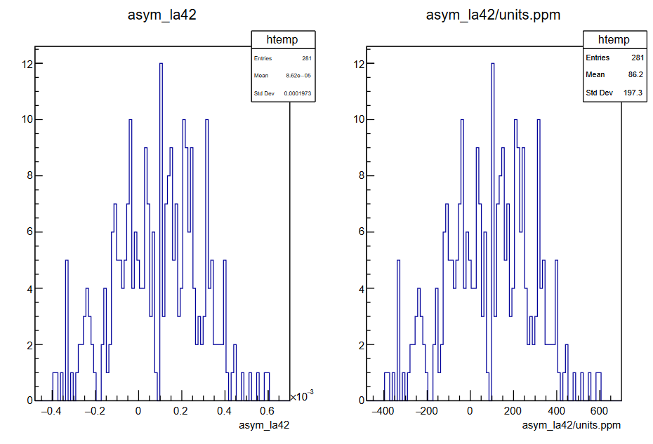

# QwMockData Root Guide
May 13 2024\
Version 0.3

#### Contact
If you have any questions or suggestions for the guide, please send an
email to:\
Ryan Conaway\
mrc@jlab.org

Running QwMockDataGenerator
===========================

Using the JAPAN-MOLLER repository, run the following commands in a
terminal:

        $  build/qwmockdatagenerator -r 4 -e 1:20000 --config qwparity_simple.conf \
           --detectors mock_newdets.map --data <Data>
        $  build/qwparity -r 4 --config qwparity_simple.conf \
           --detectors mock_newdets.map --data-handler mock_datahandlers.map \
           --data <Data> --rootfiles <Rootfiles>

General ROOT TTree Format
=========================

The ROOT TTree (or just ROOT Tree) represents columnar datasets. Each
columnar dataset is stored in a "branch" of the tree. Each branch can
have several different variables stored within the dataset, called
"leaves".

Accessing
=========

Once the rootfiles have been generated, you can access the data in two
parallel ways:

GUI
---

In a terminal, run

        $ root
        root[0] TBrowser b

A ROOT Object Browser should appear. Using this you can browser, you can
navigate to the rootfile and access the ROOT tree.

Terminal
--------

In a terminal, run

        $ root
        root[0] TFile* f = new TFile("<path/to/rootfile>")
        root[1] .ls

This will display all the objects (e.g TTrees) inside the opened
rootfile, with the form

      KEY: <OBJECT_TYPE>   <NAME>;<NAMECYCLE>   <DESCRIPTION>

To view a tree, run

        root[2] <NAME> -> Print()

This will display the branches and the leaves, with the form

      BR #:  <BRANCH_NAME> :  <leaf 1>/D:<leaf 2>.../D:<leaf N>/D:

To draw a branch, run

        root[3] <NAME> -> Draw("<BRANCH_NAME>")

To draw a leaf in the branch, run

        root[4] <NAME> -> Draw("<BRANCH_NAME>.<leaf>")

Mock Data Rootfile
==================

Opening a mock data rootfile, we should see

![Objects stored within a mock data
rootfile.[]{label="fig:view"}](Images/example_rootfile.png)

Conditions
----------

The TList object, `#_conditions`, contains the meta-data for the
QwAnalyzer. It contains the ROOT version, the hostname, rootfile
creation time, analyzer options used, the analyzer version, and other
misc. meta-data.

![Meta-data stored in the TList Condition
Object.[]{label="fig:view"}](Images/condition_TLIST.png)

Mapfiles
--------

The TList object, `mapfiles`, stores the parameter files (.map files)
used. The `--config <file>` and `--detectors <file>` flags often contain
several sub-files that are called to set the analysis parameters.

TTree evt
---------

The evt tree contains the Macro Pulse Signal (MPS) event data. The MPS
is a 960 Hz helicity signal generated at the injector that determines
when the helicity state is stable and data can be collected.

![The trigger and ADC gate timing diagram(Beminiwattha
2013).[]{label="fig:view"}](Images/MPS_Diagram.png)

TTree mul
---------

The mul (multiplicity) tree contains the helicity event data. Data is
collected during each helicity quartet, then the difference between the
quantities measured in the different helicity states are computed.

TTree pr
--------

The pr tree calculates the asymmetry of the pairs (+- or -+). This is
the shortest time scale on which we can form meaningful asymmetries.
However, these asymmetries are sensitive to drifts or variations.

TTree slow
----------

This tree contains the EPICS information inserted in the run data.
Currently, QwMockDataGenerator does not insert any EPICS information
into the data stream. (Needs to be enabled in qwparity\_simple.conf)

TTree burst
-----------

The Burst tree calculates the average over a set number of patterns,
configurable by the \"burstlength\" parameter in the .conf files. Each
\"event\" in the burst tree is one calculated average. Typical burst
size corresponds to 30sec or 1 minute. (Needs to be enabled in
qwparity\_simple.conf)

TTree evts, muls, bursts
------------------------

These trees contain the running sum data of their respective trees.
There is one event per run (data file). The muls and bursts trees should
be identical.

Branches and Leaves
===================

Each tree stores a lot of information, making it difficult to explicitly
discuss every one. Instead, we will break the branches and leaves into
categories and discuss the naming scheme. The naming convention will act
as \"building blocks\" to which we can reconstruct the intent of each
branch.

Common Leaves
-------------

Six leaves that will appear on the majority of branches are
`num_samples`, `Device_Error_Code`, `block #`, `block #_raw`, `hw_sum`,
and `hw_sum_raw`. The `num_samples` leaf is the number of samples for
the device and `Device_Error_Code` leaf is any errors for that device
(see the Error Codes and Flags section). During an acceptable sample
window, determined by the MPS, The MPS determines a acceptable sample
window which gets divided into four subsections called blocks. The
hardware sum (hw\_sum) is the full integral over the sample window. Each
device has its own calculated blocks and hardware sum.

The block values can be calculated in two ways, depending if the device
can have a mean value of zero (Diff Mode) or not (Asym mode):

| Mode | Description |
  -----------| ---------------------------------------------------------------------
  Diff Mode  | $block = mean + helicity\times asymmetry + sigma + drift$
  Asym Mode   |$block = mean\times (1.0+helicity\times asymmetry) + sigma + drift$

The drift is a sinusoidal function of time and the sigma is the
event-by-event jitter. For QwMockDataGenerator, both are determined by a
parameter file. During analysis, the block values have a weighting and
pedestal associated with them. During mock data generation, the
procedure is flipped so a block value is randomized and the raw block
value is calculated instead. These raw block values are stored in
`block_raw`.

  Keyword         |                               Description
  --------------- |------------------------------------------
  block \#|                     Asym or Diff signal (4 total)
  block\_raw \#|     Asym or Diff signal w/o a gain (4 total)
  hw\_sum|                 hardware sum (sum of the 4 blocks)
  hw\_sum\_raw|                        hardware sum w/o gain.

The physical meaning of the blocks will depend on the devices
associated. These devices can be detectors or beam monitors. See the
Detector sections, BPM section, or BCM section for more details
regarding the various devices.

### Evt Specific Leaves

The majority of the branches in the evt ROOT tree will have leaves that
are derived from the block leaves mentioned in the Common Leaves
Section. This includes the minimum value of each block, the maximum
value of each block, the addition of the blocks in quadrature, and the
sequence number.

  Keyword   |                                Description
  ------------------| ----------------------------------
  RawMin\_\#|             Minimum raw value for block \#
  RawMax\_\#|             Maximum raw value for block \#
  SumSqA\_B|            Quadrature sum of blocks A and B
  sequence\_number|                  ADC sequence number

These leaves are not present in other trees.

### Mul Specific Branches

The mul ROOT tree will have a several branches that correspond to
helicity-based quantities computed for corresponding evt tree branches.
These helicity-based quantities include the `asym`, `diff`, and `yield`.
How these values are calculated can vary depending on the device they
are calculated for. Below is a figure that demonstrates how the various
helicity quantitues are calculated.

The branches for the helicity-based quantities always start with the
quantity keyword followed by the device name (device names correspond
one-to-one to the branch names found in the evt tree):

In the above output from `evt->Print("asym*")`, we see the branch name,
`asym_la14`.
 Keyword | Meaning
 --- | ---
  asym\_ |      Asymmetry calculation
  la14 |  Large Angle Monitor (See Detector section)

We can see that this branch corresponds to the helicity multiplet
asymmetry calculated for the large angle monitor device.

BCM
---

The Beam Charge Monitor (BCM) is a cylindrical shaped cavity with an
antenna, or wire, inside to detect electromagnetic radiation from the
electron beam. The signal amplitude corresponds to the amount of beam
passing through the device. The BCM and BPM together constitute the
beam-monitoring devices (Beminiwattha 2013). The naming scheme for the
BCM branches always starts with `bcm` and then is followed by a keyword
that indicates where in the beamline it is monitoring:

  Keyword |                       Description
  ---------| --------------------------------
  0lXX|        Injector / Pre-Accelerator BCM
  0rXX|                        Recombiner BCM
  0hXX|                            Hall A BCM

The `XX` indicates the position of the BCM within that beamline section. One thing to note is
that the BCMs will sometime have the prefix `qwk_`, this is a holdover
from the Qweak experiment and is innocuous. It will most likely be
phased out as japan-MOLLER matures.

### BCM Example

In the above output from `evt->Print("*bcm*")`, we see the branch name,
`qwk_bcm0l05`
Keword| Meaning
  ------------------------------| --------------------------------
  qwk\_|           Holdover from Qweak
  0l |   Injector / Pre-Accelerator BCM
  05 |     Fifth BCM

We can see that this branch corresponds to a BCM located at the
injector.

BPM
---

The Beam Position Monitor (BPM) is a cylindrical cavity with four
symmetrical antennas, or wires, that pick up the RF-signal of the
passing electron beam. The wires form a box that the beam passes
through. The amplitude of the signal from each wire is proportional to
the distance to the beam. From the four wires, we can obtain the x and y
coordinate of the beam. The BPM and BCM together constitute the
beam-monitoring devices(Beminiwattha 2013).The naming scheme for the BPM
branches always starts with `bpm` or `qwk_` and is followed by two
keywords, one that indicates where in the beamline it is monitoring and
the other what beam parameter it is monitoring. We will start with the
location keywords first:

  Keyword     |        Description
  ---------| ---------------------
  0iXX|               Injector BCP
  0lXX|        Pre-Accelerator BPM
  0rXX|             Recombiner BPM
  0hXX|                 Hall A BPM
  1cXX|                 Transport Line BPM

Next we will examine the beam parameter keywords:

  Keyword |                      Description
  ---------| -------------------------------
  XP|          X-Position (sometimes just X)
  XM|                                X-Slope
  YP|          Y-Position (sometimes just Y)
  YM|                                Y-Slope
  Elli|                          Ellipticity
  WS|                               Wire Sum

The `XX` indicates the position of the BPM within that beamline section.
Often BPMs will be labeled with `qwk` like the BCMs; however, the BCMs will always have the
the form `qwk_bcm` whereas the BPMs will just use `qwk_XXXX` instead of
`bpmXXXX`. This is a holdover from the Qweak experiment and is
innocuous. It will most likely be phased out as japan-MOLLER matures.

### BPM Example

In the above output from `evt->Print("*qwk*")`, we see the branch name,
`qwk_0l06aXm`. Note the use of `qwk_` in lieu of `bpm`.
Keword| Meaning
  --------------------------------| ---------------------
  qwk\_ | Holdover from Qweak
  0l |   Pre-Accelerator BPM
  06a |        6th BPM
  XM |         X-Slope

We can see that this branch corresponds to a BPM located at the injector
and monitors the X-Slope.

Detectors
---------

For the mock data generator and analyzer, the detectors are configured
by detector map files and are declared by the `--detectors` flag. There
are five main detectors: thin quartz detector, pion detector, shower
max, large angle monitor, and small angle monitor.

### Thin Quartz

The thin quartz detectors are Cherenkov detectors that form the main
detector element. The thin quartz detectors are organized into six
radial rings that span 7 azimuthal sectors. These sectors are subdivided
into 4 additional segments, totalling 28 azimuthal bins. The primary
MOLLER measurement will occur in ring 5 so that ring is further
subdivided by three more segments, giving 84 channels. In total, there
are 224 thin quartz detectors channels.

The thin quarts detectors are labeled as `tq` in the ROOT tree. The
segment that the thin quarts correspond to denoted explicitly by a
numeric value, i.e. `tq4` indicates a thin quarts in segment 4. The
radial ring that the thin quarts corresponds to is indicated after the
segment by `_r#`. Since ring 5 is divided further into three more
segments, ring 5 segments are denoted by `a,b,c (1,2,3)`.

In the above output from `evt->Print("tq*")`, we see the branch name,
`tq24_r5a`
        Keyword | Meaning
  ------------------------| ---------------------
  tq | thin quartz
  24 |   segment 24
  \_r5 |   ring 5
  \_r5a |    ring 5 subsection a

We can see that this branch corresponds to a ring 5 thin quartz
detector, in segment 24, and in the additional ring 5 sub-segment a.

### Pion Detector

The pion detectors are a collection of 28 (one per segment) acrylic
Cherenkov detectors that measure hadronic background contribution and
their asymmetries. This allows for corrections to the ring 5
measurements. In the ROOT tree, it is labeled as `pd`. The segment that
the pion detector corresponds to is given by a numeric following the
`sm` label.

In the above output from `evt->Print("pd*")`, we see the branch name,
`pd11`
        Keyword | Meaning
  --------------------------| ---------------
  pd | Pion Detector
  11 |   segment 11

We can see that this branch corresponds to a pion detector in segment
11.

### Shower Max

The shower max detector is an array of 28 (one for each segment)
quartz-tungsten electromagnetic sampling calorimeters downstream of the
thin quartz detectors. The shower max detectors intercept the same
scattered flux as the thin quartz radial ring 5. It provides a
supplemental, energy-weighted Møller signal that less sensitive to
hadronic and low-energy backgrounds. In the ROOT tree, the shower max
detectors are labeled as `sm`. The segment that the shower max detector
corresponds to is given by a numeric following the `sm` label.

In the above output from `evt->Print("sm*")`, we see the branch name,
`sm03`
        Keyword | Meaning
  ------------------------| ------------
  sm | Shower Max
  03 |   segment 03

We can see that this branch corresponds to a shower max in segment 3.

### Large Angle

The large angle monitors detectors consist of seven quartz radiator and
pmt modules, one for each sector. They are located downstream of the
target and are positioned to detect large angle scattering. In the ROOT
tree, the large angle monitors are labeled as `la`, followed by a
numeric that specifies which detector and channel it corresponds to.

In the above output from `evt->Print("la*")`, we see the branch name,
`la38`. Each detector has 8 channels, so the divisor of the numeric mod
8 corresponds to the sector, and the remainder corresponds to the
channel.
 
 Keyword | Meaning
  ------------------------| -------------------------------------------------------------
  la | Large Angle Monitor
  38 |     $38 = \underline{4}*8 + \underline{6}$; Sector 4, Channel 6

We can see that this branch corresponds to a channel 6 of the large
angle monitor in sector 4.

### Small Angle

The small angle monitor detectors consist of eight fused-silica
radiators and pmt modules that are uniformaly spaced around the azimuth.
The small angle monitors are downstream from the target. In the ROOT
tree, they are labeled as `sa`, followed by a numeric. The numeric
indicates which small angle monitor the branch corresponds to.

In the above output from `evt->Print("sa*")`, we see the branch name,
`sa06`.

 Keyword | Meaning
  ----------------------| ---------------------
  sa | Small Angle Monitor
  06 |   Monitor 6

We see that this branch corresponds to the 6th small angle monitor.

Error Codes and Flags
---------------------

Errors can arise during the data as configuration errors, event errors,
or hardware errors (HW). Error codes are stored as hexadecimal values
either in a branch or (more likely) a leaf of a device branch, labeled
`Device_Error_Code`. The evt tree is unique in that it is the only tree
with `Error_Flag` branch. When an error is found, the error code is
formed by the logical OR of all applicable error flags. The codes can be
found below:

### Hardware Error

  Hex   | Name|                                                           Description
  ------ |----------------------- |--------------------------------------------------
  0x01   |kErrorFlag\_VQWK\_Sat|                                   ADC Saturation Cut
  0x02   |kErrorFlag\_sample    |      Sample size mis-match with the mapfile default
  0x04   |kErrrorFlag\_SW\_HW    |              Software sum and HW sum are not equal
  0x08   |kErrorFlag\_Sequence    |  ADC sequence number is not incrementing properly
  0x10   |kErrorFlag\_SameHW      |             ADC returns the same value repeatedly
  0x20   |kErrorFlag\_ZeroHW      |                Check if the ADC is returning zero

### Event Error

  Hex|    Name|                                            Description
  ------ |-------------------------| ---------------------------------
  0x40   |kErrorFlag\_EventCut\_L|     Lower limit of event cut failed
  0x80   |kErrorFlag\_EventCut\_U |    Upper limit of event cut failed

### Configuration Errors

  Hex |         Name|                                                     Description
  ------------ |------------------------- |------------------------------------------
  0x0100       |kBCMErrorFlag            |          Single event cut failed for a BCM
  0x0200       |kErrorFlag\_BlinderFail  |                             Blinder failed
  0x0400       |kBPMErrorFlag            |          Single event cut failed for a BPM
  0x0800       |kPMTErrorFlag            |          Single event cut failed for a PMT
  0x8000       |kBModErrorFlag           |                        Beam modulation cut
  0x020000     |kErrorFlag\_Helicity     |          Generic Helicity Decoding failure
  0x20000000   |kErrorFlag\_BurpCut      |                           Burp cut failure
  0x80000000   |kBadEventRangeError      |   Event Range that is no longer acceptable

### Flags

Some events will have specific flags associated with them to help us
identify them during analysis.

  Hex|          Name|                                                  Description
  ------------ |--------------------- |-------------------------------------------
  0x1000       |kBModFFBErrorFlag   |           Energy modulation pause period cut
  0x010000     |kEventCutMode3      |    Mode 3; only flag event cut failed events
  0x02000000   |kLocalCut           |                     Event cut is a local cut
  0x04000000   |kGlobalCut          |                 Single event is a global cut
  0x08000000   |kBeamTripError      |            An event within a beam trip range
  0x10000000   |kBeamStabilityError |                                Stability cut

### Error Code Example

Opening up the evt tree and scanning the ErrorFlag branch, we see that
we have the decimal error code `67305475`, or converting to hexadecimal,
`0x04030000`.
         Keyword | Meaning
  ----------------------------| ---------------------------------------
  0x04000000 | kGlobalCut
  0x00030000 |   kEventCutMode3 & kErrorFlag\_Helicity

The reported error flags and codes indicate that the event is in Mode 3,
using a global cut, and that a general helicity decoding error has
occurred.

Special Branches
----------------

### Phase Monitor

This is a BCM that monitors the transverse phase of the beam.

### Batery

This is a physical battery that is connected to the ADC channels. It provides a constant voltage to the ADCs. 

### Units

All the ROOT trees have a units branch. This branch stores unit
conversions in the leaves for `ppm`, `ppb`, `um`, `mm`, `mA per uA`, and `V per uA`. To use the unit conversions, you scale
the histograms by the `units.<leaf>`.

### Helicity Branches

The helicity branches are an assortment of branches that contain event's
helicity meta-data. These include counter branches such as `mps_counter`
and `pat_counter` which count the number of MPS signals and the number
of 64-mulitplet helicity pattern respectively. The branch `pat_phase`
tracks which 64-multiplet helicity an event corresponds to.

Useful Navigation Tips
----------------------

If you are using the terminal to access the rootfile, and only want to
view specific branches, you can specify the output of the
`(TTree)->Print()` command by inserting a string between the
parenthesis.

i.e: `root [1] evt->Print("bcm*")`

This will print out all the branches that start with `bcm`. Likewise,
you can search for branches that end in `bcm` with the command
`Print("*bcm")`. You can also search for branches that contain `bcm`
somewhere with `Print("*bcm*")`. Lastily, you can search for a branch
that contains `bcm` and another keyword by `Print("*bcm*0l*")`.

